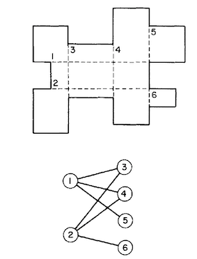

# clip
Clipping code based on

# [Minimal Rectangular Partitions of Digitized Blobs](https://kundoc.com/pdf-minimal-rectangular-partitions-of-digitized-blobs-.html)
_L. FERRAIU, P.V. SANKAR, AND J. SKLANSKY_
_Department of Electrical Engineering, University of California, Irvine, California 92717_
_Received March 25,1983; accepted February 15,1984_

An algorithm is presented for partitioning a finite region of the digital plane into a minimum number of rectangular regions. It is demonstrated that the partition problem is equivalent to finding the maximum number of independent vertices in a bipartite graph. The graph’s matching properties are used to develop an algorithm that solves the independent vertex problem. The solution of this graph-theoretical problem leads to a solution of the partition problem.
0 1984 by A&&c Press, Inc.

A rectangular partition of a blob on R, B, is a partition {Pi} i=1..M, such that
(∪ Pi = B) ∧ (Pi ∩ Pj = Ø i≠j) ∧ (Piis a rectangle for all i).
M is defined as the order of the partition {Pi}.

#### LEMMA 1.
For a blob on R whose boundary contains N noncogrid concave vertices and no cogrid concave
vertices, there exists a minimum order rectangular partition of order N + 1.

I. Minimality. For each concave vertex, I, we select and extend to the blob’s interior one of its
edges. The extension will terminate at:
(1) The digital blob’s boundary, or
(2) The extension of some other concave vertex, J, into the blob’s interior.
Such a procedure will partition the blob’s interior into N + 1 regions. This is clear since each
concave vertex is located in a single subregion and its extension divides the subregion into two new
subregions. Then by induction we obtain N + 1 subregions.
Each concave vertex must have at least one extension to ensure a rectangular partition. If not, some
subregion contains an interior angle of 270° and is clearly not a rectangular region. Since none of
these extensions can be cogrid, the number of subregions formed by the procedure is N + 1.

II. Rectangularity. If we show the subregions are all rectangles, the proof is complete.
(1) Each of the concave vertices is divided into an angle of 90° and an angle of 180°.
(2) The intersection of a vertex I extension must intersect a vertex J extension at 90°. This is
true since all extensions are either horizontal or a vertical. An intersection angle of 180°
contradicts the noncogrid assumption. This leaves the only other possibility of 90°.
(3) The intersection of an extension of a vertex I extension must intersect the blob’s boundary at
90° or 180°. The case 180° implies we have cogrid concave vertices: a contradiction. (A convex
vertex can only be approached from the exterior of the blob.)
This implies all interior subregion angles are 90°. Then the N + 1 subregions are all rectangles. ∎

Let C’ denote a set of nonintersecting chords connecting points on the boundary of a blob B.
Let |C‘| = L’ and ci‘ denote an element of C‘, i = 1,2,..L’.
Let c denote a chord correcting two points on the boundary of B such that c and C’ share no boundary
points. Let x denote the number of intersections of c with C’.
We then state

#### LEMMA 2.
The set C’ and the chord c partition B into L’+x+2 regions

#### THEOREM 1.
A blob B on a rectangular mosaic R has a minimum order rectangular partition of order
P = N - L + 1 where
    N = Total number of concave vertices on the boundary of B.
    L = Maximum number of nonintersecting chords that can be drawn between cogrid concave vertices.

Part 1
The L nonintersecting chords partition B into L+1 subregions {bi} i = 1..L+1.
Each bi contains ci noncogrid concave vertices.
    Σ{i=1..L+1}ci = N-2L  Total number of noncogrid vertices.
                          LHS: by definition of ci.
                          RHS: number of concave vertices - (2 vertices) x number of cogrid vertices

    ∃ P = Σi=1L+1(ci+1) by LEMMA 1
        = Σ{i=1..L+1}ci + L+1
        = N-2L + L+1  (Total number of noncogrid vertices)
        = N-L+1

Part 2 (Minimality)
Every concave vertex on the boundary of B must have at least one extension as described in the proof
of Lemma 1.
Let
    ϕ denote an arbitrary rectangular partition of B.
    C denote the set of chords joining cogrid vertices in ϕ.
    C’ ⊆ C be a subset of C such that all chords, ci’ ∈ C’, are nonintersecting.
       C’ partitions B into L’+1 subregions which are not necessarily rectangular.
    L’ = |C’|.
    C” = {c”| c” ∈ C - C’ and c” intersects C’}.
    Xi {i = 1,2,..,L} be the number of intersections of chord ci” ∈ C” with the set C’.
       Clearly Xi ≥ 1.

Let
    P denote the number of rectangles in ϕ.
    M be the increase in the number of subregions introduced by the set C” in the partition ϕ.
       M = M1 + M2 + M3 where
          M1 = Σ{i=1..L1} (Xi + 1) ≥ Σ{i=1..L1} 2 = 2 x L1
             when L1 chords ci” share no boundary points with C’.
          M2 = Σ{i=1..L2} Xi ≥ Σ{i=1..L1} 1 = L2
             when L2 chords ci” share one boundary point with C’.
          M3 = Σ{i=1..L3} (Xi - 1) ≥ Σ{i=1..L3} 0 = 0
             when L3 chords ci” share two boundary points with C’.

Let S denote the number of regions generated by the construction of the chords ci’ and ci”.
Then S = M + L’ + 1.
The total number of noncogrid concave vertices in the S subregions is Q = N - 2L’- 2L1 - L2.
By Lemma 1 and Part I of this theorem, the number of rectangles, P, in ϕ is

    P = S + Q
      = M + L’ + 1  +  N - 2L’- 2L1 - L2
      = M1 + M2 + M3 + L’ + 1  +  N - 2L’- 2L1 - L2
      = N - L’ + 1 + (M1 - 2L1) + (M2 - L2) + M3
      ≥ N - L’ + 1         L’ = number of nonintersecting chords between cogrid vertices
      ≥ N - L + 1          L = number of chords between cogrid vertices
∎

Theorem 1 shows only the existence of a minimal order rectangular partition. In the remainder of
this paper we show how to find an L set of chords which constitutes a _maximal set of nonintersecting
chords_ as described in the theorem. Once this set of chords has been found, we use Lemma 1 to obtain
the minimum order rectangular partition.

We first reduce the problem of finding L nonintersecting chords to a graph theory problem.
Define a graph G = (V, E) such that
    1) Each vi ∈ V corresponds to cogrid chord, say i, of B.
    2) Each edge vi, vj ∈ E corresponds to the intersection of i and j in B.

Let G = (V, E) be a graph. See [6,7].

DEFINITION 6. A set of vertices (edges) which covers all the edges (vertices) of G is called a
    vertex cover (edge cover) for G.

DEFINITION 7. The smallest number of vertices (edges) in any vertex (edge) cover for G is called a
    vertex (edge) covering number and denoted by α0(G) (α1(G)).

DEFINITION 8. A set of vertices (edges) in G is called independent if no two of its members are
    adjacent.

DEFINITION 9. The largest number of vertices (edges) in an independent set is called the vertex (edge)
    independence number, β0 (β1).

DEFINITION 10. A bipartite graph G is a graph whose vertex set V can be partitioned into two subsets
    V1 and V2, such that every edge of G joins V1 with V2.

THEOREM 2. (Gallai): For any nontrivial connected graph G, p = α0 + β0 = α1 + β1 where p = |V|.

DEFINITION 11. A set of β1 independent edges in G is called a maximum matching of G.

THEOREM 3. (König): If G is bipartite, then the number of edges in a maximum matching equals the
    vertex covering number, that is β1 = α0 .

## 6. THE GRAPH REDUCTION OF PROBLEM L CHORD

In graph-theoretic terms, we are able to restate problem L Chord as follows:
Graph Problem. For the graph G = (V, E) defined above, find the largest subset of independent nodes
of G, i.e. the largest subset of chords containing no intersections. We note that in the
rectangular partition, all chords are either horizontal or vertical. Consequently we have the
following lemma.

#### LEMMA 3. The graph G = (V,E) is a bipartite graph.

  Suppose we have a maximum matching on a bipartite graph
G = ((U,V),E). Let the matching contain k edges (a _k_ matching).
We observe the matching partitions the vertex sets U and V into sets U’, U”, V’, and V”,
respectively such that U’ and V’ contain only matched vertices and U” and V” contain independent
vertices (Fig. 4). Let (ui,vi) designate the ith pair of vertices in the matching.

#### LEMMA 4. There does not exist any path from U” to V” that contains an edge (ui,vi).

We now state Algorithm 1, which describes a procedure for finding the maximum independent set of vertices of a bipartite graph.

## Algorithm 1. Find the maximum independent set of vertices for a bipartite graph.

  Step 1 - Find the maximum matching for the bipartite graph G = ((U,V),E).

  Step 2 - Color each pair of matched vertices (ui,vi) red. For each pair of red vertices do the
    following:
   (a) If there exists an edge from ui to V” in G, color ui green and vi blue or,
       if there exists an edge from vi to U” in G, color vi green and ui blue.
   (b) Recursively color each remaining red vertex connected in G to a blue vertex green, and
       color its matched vertex blue.

  Step 3 - For all remaining pairs of red colored vertices (uj,vj):
  color uj blue and vj green if vj is connected to a green vertex.
  Go to 2b.

  Step 4 - For all remaining pairs of red vertices color uj green and vj blue.

  Step 5 - Color all vertices u ∈ U” and all v ∈ V” blue. ∎

## Polygon Examples

           +---+
           | 1 |
       +---+···|            N=1
       |   2   |            L=0
       +-------+            Rectangles=2

           +---+
           | 1 |
       +---+···|            N=2
       |       |            L=0
       |   2   +---+        Rectangles=3
       |       : 3 |
       +-----------+

           +---+
           | 1 |
       +---+···+---+        N=2
       |     2     |        L=1
       +-----------+        Rectangles=2

           +---+
           | 1 |
       +---+···+---+        N=4
       |     2     |        L=2  "Non-intersecting" must include not sharing a vertex.
       +---+···+---+        Rectangles=3
           | 3 |
           +---+

           +---+
           |   |
       +---+   +---+        N=4
       | 1 : 2 : 3 |        L=2  "Non-intersecting" must include not sharing a vertex.
       +---+   +---+        Rectangles=3
           |   |
           +---+

               +---+
               | 1 |
       +-------+···+---+    N=4
       |       2       |    L=2
       +---+···+-------+    Rectangles=3
           | 3 |
           +---+

           +---+
           | 1 |
       +---+···+---+        N=3
       |       : 3 |        L=1  "Non-intersecting" must include not sharing a vertex.
       |   2   +---+        Rectangles=3
       |       |
       +-------+

           +---+
           |   |      IS THIS ALLOWED? Partial inner paths.
       +---+ 1 |
       | 2 :   |            N=3
       |·······+-------+    L=0
       |           : 3 |    Rectangles=4
       |     4     +---+
       |           |
       +-----------+

           +---+
           | 1 |
       +---+···|
       |   2   |            N=3
       |·······+-------+    L=0
       |       3       |    Rectangles=4
       |···········+---+
       |     4     |
       +-----------+

           +---+
           |   |
       +---+   |
       | 1 :   |            N=3
       |   : 2 +-------+    L=0
       |   :   :   : 4 |    Rectangles=4
       |   :   : 3 +---+
       |   :   :   |
       +-----------+

       +-----------+        N=3
       |     1     |        L=1
       +---+···+---+        Rectangles=3
           |   |
       +---+ 2 |
       | 3 :   |
       +-------+

       +-----------+        N=3
       |     1     |        L=1
       +---+···+---+        Rectangles=3
           | 2 |
       +---+···|
       |   3   |
       +-------+

## References
[Rectangular Decomposition of Binary Images](http://library.utia.cas.cz/separaty/2012/ZOI/suk-rectangular%20decomposition%20of%20binary%20images.pdf)
Having a binary object B (by a binary object we understand a set of all pixels of a binary image whose values equal one), we decompose it into K ≥ 1 blocks B1,B2,.., BK such that Bi ∩ Bj = ∅ for any i !≠ j and B = ∪k=1..B(Bk)

[Matching](https://en.wikipedia.org/wiki/Matching_\(graph_theory\)) A matching or independent edge set in a graph is a set of edges without common vertices.
   https://www.geeksforgeeks.org/maximum-bipartite-matching/
   https://www.geeksforgeeks.org/ford-fulkerson-algorithm-for-maximum-flow-problem/
   https://en.wikipedia.org/wiki/Edmonds_matrix

https://en.wikipedia.org/wiki/Independent_set_(graph_theory)
https://en.wikipedia.org/wiki/Hopcroft%E2%80%93Karp_algorithm
https://en.wikipedia.org/wiki/Blossom_algorithm
https://en.wikipedia.org/wiki/Flow_network
https://www.fileformat.info/info/unicode/block/mathematical_operators/utf8test.htm
https://en.wikipedia.org/wiki/Menger%27s_theorem
